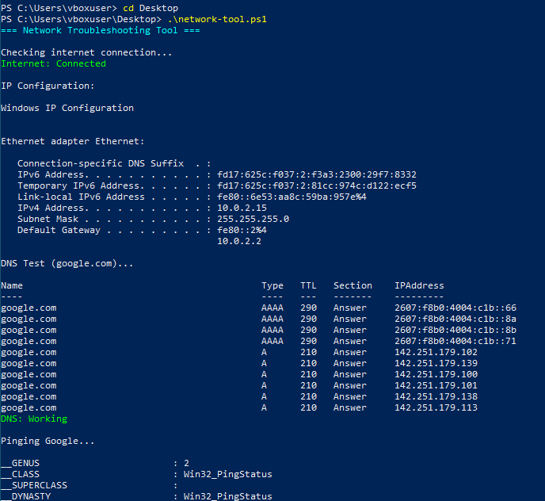

# Network Troubleshooting Tool

## Overview
This project is a beginner PowerShell-based IT network troubleshooting tool that performs basic network diagnostics including connectivity, DNS resolution, IP configuration, and latency testing.

## Features
- Internet connectivity check  
- DNS resolution test  
- IP configuration display  
- Network latency (ping) test  

## Technologies Used
- PowerShell  
- Windows 10 VM  
- VirtualBox  

## Purpose
This project was built to practice:

- IT troubleshooting  
- Network diagnostics  
- Windows command-line tools  
- PowerShell scripting  
- basic automation  

## How to Run
Open PowerShell and run:

```powershell
.\network-tool.ps1
```

## Author
Parthiv Patel

## Output Screenshot


